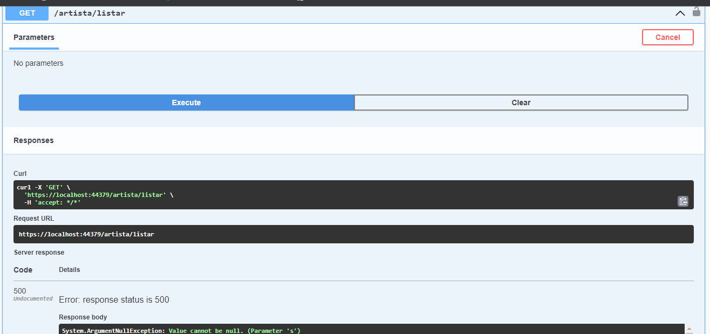
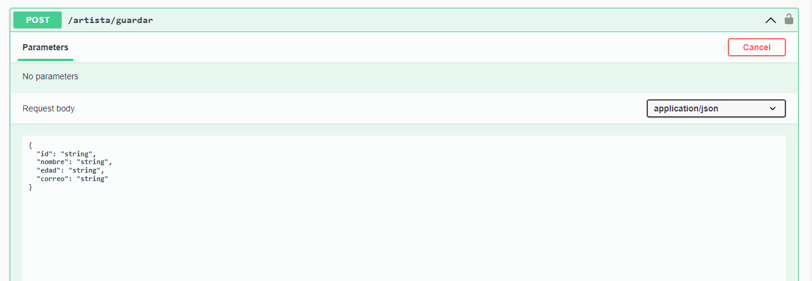
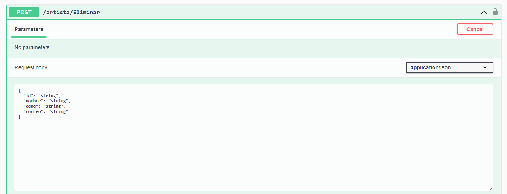
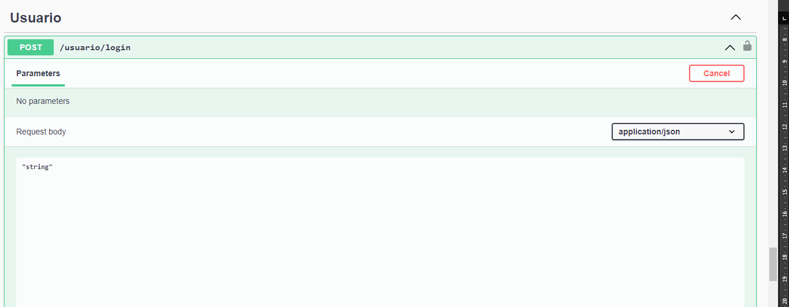
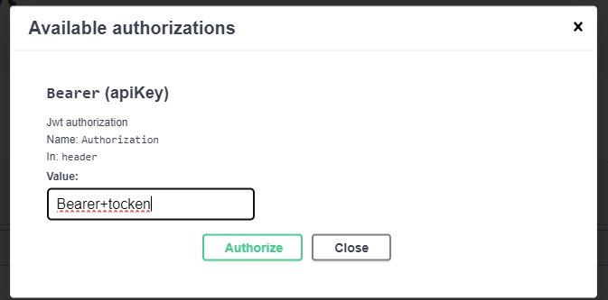

# CREACION DE UNA API CON JWT Y MIDDLEWARE
**Nombre:** Mateo Barriga.
**Fecha:** 03/12/2023
**NRC:** 14956

## Requisitos

- Visual Studio 2022.
- Navegador de su preferencia. 
- Cuenta de GitHub
- Paquetes de instlacion para C#, .NET. 

## Instalación
- Clonamos el siguiente reposito para poder realizar la ejecucion. 
- Entramos a la carpeta y buscamos el archivo, API_NET8_CALENDARIO.sln.
- Se abrira el Visual Estudio 2022 y podremos ejecutar el proyecto.
- Tomar en cuenta que se debe correr el programa con el formato IIS Expres
- Se podra visualizar el programa en el navegador.
## Ejecución
Dentro de este proyecto podemos encontrar metodos get y post para la creacion de metodo CRUD en donde a nuestro proyecto se le designo ciertos usuairos que pueden realizar ciertas operacion como es el de eliminar, al igual que dentro de la API usamos NUGEST para poder implemetar el JWT y el middleware.
Se implento de igual forma un boton para la autorizacion de los tockens que le de da a cada uno de los usuarios, con esto puede tener o no la valiacion de realizar las operaciones. 
A continuacion imagenes del proyeto. 
1. 

2. 

3. 

4. 

